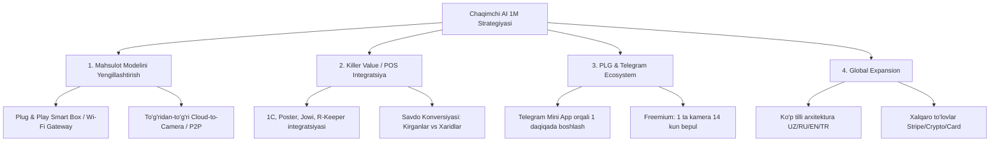
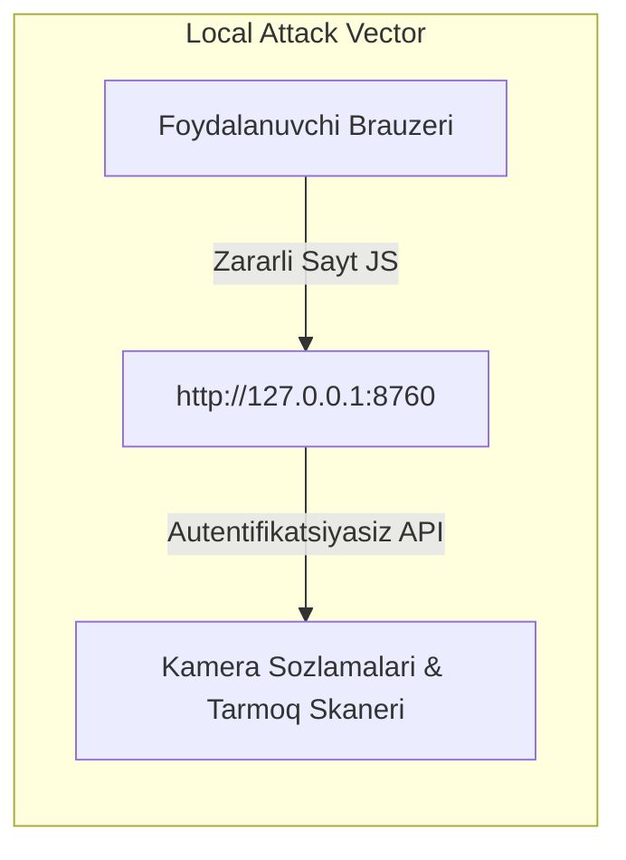

# Chaqimchi AI — Keng Qamrovli Strategik Audit, Tizim Tahlili va Rivojlantirish Rejasi

> **Hujjat turi:** Boshqaruv, Arxitektura, QA, UI/UX, Biznes va Kiberxavfsizlik Auditi  
> **Sana:** 2026-08-23  
> **Holati:** Loyihaning mavjud kod bazasi asosida tuzilgan to'liq mustaqil tahlil (hech qanday kod o'zgartirilmagan holda).

---

## 1. Loyiha 1 Million Foydalanuvchiga Chiqa Oladimi? (Super Founder Tahlili)

### 1.1. Mavjud Holat va Bozor Cheklovlari (Bozor Hajmi / TAM)
* **Target Auditoriya:** Hozirgi mahsulot fokusi — O'zbekistondagi jismoniy chakana savdo do'konlari (retail, bitta nuqtada 1-4 kamera).
* **Bozor Sig'imi (TAM - Total Addressable Market):** O'zbekistonda jami faoliyat yuritayotgan do'konlar soni taxminan **250,000 – 350,000** tani tashkil etadi. Demak, **faqat O'zbekistonning kichik do'konlari bilan 1 million to'lovchi mijozga chiqish matematik jihatdan imkonsiz.**
* **1 Million foydalanuvchiga chiqish uchun zarur yo'nalish:**
  1. **Geografik kengayish:** Markaziy Osiyo (Qozog'iston, Qirg'iziston, Tojikiston), Ozarbayjon, Turkiya, Yaqin Sharq va Janubi-Sharqiy Osiyo bozorlari.
  2. **Segmentni kengaytirish:** Faqat oziq-ovqat/kiyim do'konlari emas — dorixonalar, kafe/restoranlar, omborxonalar, ofislar, ishlab chiqarish sexlari, xususiy klinikalar va fitnes zallari.
  3. **Mahsulot modelini o'zgartirish (B2B + B2B2C):** Do'kon xodimlari va menejerlari uchun shaxsiy kabinetlar, franchayzalar va ko'p tarmoqli riteyllar (Korzinka, Havas, Ishonch, Bellstore kabi yirik tarmoqlar).

---

### 1.2. Tarqatish va Masshtablashdagi To'siqlar (Bottlenecks)
1. **Apparat To'sig'i (Hardware Barrier):**
   * Hozirgi asosiy yo'nalish — do'kondagi **Windows 10/11 kompyuteri**.
   * *Muammo:* Ko'plab kichik do'konlarda shaxsiy kompyuter yo'q yoki juda eski (Celeron, 2-4 GB RAM), yoxud u 1C kassa uchun ishlatiladi. Kompyuter kechasi o'chiriladi.
   * *Oqibat:* "Zero-touch onboarding" imkonsiz bo'ladi, mijozni ulash uchun usta/mutaxassis borishi shart bo'lib qoladi ("High-Touch Sales"). Bu esa 1 million mijozga yetishish xarajatlarini (CAC) keskin oshiradi.
2. **Kamera Protokoli (RTSP/ONVIF lokal tarmoq talabi):**
   * Do'kondor o'zining NVR/kamera parolini bilmasligi, IP manzillar o'zgarib turishi sababli o'z-o'zini sozlash (self-serve) foizi past bo'ladi.
3. **Mijozni ushlab qolish (Retention / Churn Rate):**
   * Agar do'kon egasi faqat "nechta odam kirdi" degan quruq raqamni ko'rsa, 2-3 oydan keyin qiziqishi so'nadi va oylik $20 to'lovni bekor qiladi.

---

### 1.3. Maqsadli Yechim va Strategik Rivojlanish Xaritasi (Super Founder Action Plan)



1. **"Zero-Hardware" yoki $35 lik Plug-and-Play AI Dongle/Box:**
   * Mijoz kompyuteriga bog'liqlikni yo'qotish. Kameraning orqasiga yoki routerga ulanadigan mikro-qurilma (yoki to'g'ridan-to'g'ri kameralar bilan P2P oqim).
2. **Kassa / POS bilan 100% integratsiya:**
   * Do'kondorga pul topib beruvchi formula: **Yo'qotilgan savdoni qaytarish.**
   * *Misol:* "Bugun 350 mijoz kirdi, 70 ta chek urildi (20% konversiya). 45 kishi kassa navbati 8 daqiqadan oshgani sababli savatni tashlab ketdi — yo'qotilgan daromad: ~3,200,000 so'm."
3. **Product-Led Growth (PLG) va Telegram Mini App:**
   * O'zbekiston va MDHda do'kondor brauzer ochmaydi. Telegram bot ichidagi to'liq WebApp orqali hamma narsani 1 tugma bilan ko'radi.

---

## 2. QA (Quality Assurance) Auditi — Xatolar va Yechimlar

### 2.1. Kod Bazasi va Ishlash Jarayonidagi Kritik Xatolar

| # | Modul / Fayl | Aniqlangan Muammo | Potensial Oqibat | Tavsiya etilgan Yechim |
|---|---|---|---|---|
| 1 | `cloud/store.py`, `cloud/event_store.py` | **SQLite Concurrency & Lock:** Bir nechta thread/jarayonlar bir vaqtda yozganda `sqlite3.OperationalError: database is locked` yuzaga keladi. | Yuklama oshganda eventlar yo'qoladi, API 500 beradi. | Productionda PostgreSQL (asosiy baza) va TimescaleDB/ClickHouse (hodisalar uchun) ga o'tish. |
| 2 | `chaqimchi_ai/local/app.py`, `pipeline.py` | **Windows Sleep / Power State:** Do'kon kompyuteri kutish rejimiga (Sleep/Hibernate) o'tganda fon xizmati to'xtaydi. | Tahlil to'xtab qoladi, do'kondor tizim ishlamayapti deb o'ylaydi. | O'rnatuvchi orqali Windows Power Plan sozlamasini (`SetThreadExecutionState` / `powercfg`) to'g'rilash yoki ogohlantirish berish. |
| 3 | `chaqimchi_ai/retail/pipeline.py` | **RTSP Stream Drop & Memory Leak:** Kamera signali uzilganda `cv2.VideoCapture` thread bloklanishi yoki xotira oshishi mumkin. | Dastur qotib qoladi, kompyuter xotirasi to'ladi. | Reconnect mantiqiga qat'iy watchdog va alohida process-level izolyatsiya qo'yish. |
| 4 | `cloud/faces.py`, `chaqimchi_ai/retail/` | **Yuz tanishda yorug'lik va burchak sezgirligi:** Do'kon kamerasining burchagi (yuqoridan pastga) sababli yuzlar deformatsiyalanadi. | Xodim davomatida False Negative (tanimaslik) ko'payadi. | Yuz burchagi filtri (yaw/pitch threshold) va yorug'likni avtomatik normallash (CLAHE). |
| 5 | `cloud/payments/payme.py`, `click.py` | **Race Condition to'lovlarda:** Parallel so'rovlarda obuna muddatini ikki marta hisoblash xavfi. | Balans yoki obuna hisob-kitobida nomuvofiqlik. | Baza darajasida atomik tranzaksiya va `SELECT ... FOR UPDATE` (PostgreSQL) ishlatish. |
| 6 | `docs/DOKON_MVP.md` | **72-soatlik jonli Soak Test qilinmagan:** Haqiqiy do'konda 4 kamera bilan 72 soatlik sinov o'tkazilmagan. | Haqiqiy yuklamada kutilmagan restartlar chiqadi. | Test stendi va kamida 3 ta do'konda 72 soatlik pilot soak test o'tkazish. |

---

## 3. Oddiy Foydalanuvchi va O'rnatish Tahlili (40 Yoshli Tadbirkor Nigohi)

### 3.1. Foydalanuvchi Portreti va Psixologiyasi
* **Kim u?** 40 yoshli tadbirkor. IT mutaxassisi emas. RTSP nima, IP nima, Port nima — tushunmaydi va o'rganishga vaqti yo'q.
* **Qanday ishlaydi?** Do'konga keladi, savdo bilan shug'ullanadi, xodimlarni boshqaradi. Kechqurun kompyuterni o'chirib ketadi.
* **Xavf:**
  * O'rnatish jarayonida Windows Defender **"SmartScreen noma'lum dasturni to'xtatdi"** degan xavf oynasini chiqarsa — u darhol dasturni virus deb o'ylab o'chirib tashlaydi.
  * Kameralar parolini bilmasa, sozlash sehrgarida qotib qoladi.

### 3.2. Yaxshilash Bo'yicha Tavsiyalar
1. **O'rnatuvchini Microsoft EV Code Signing Sertifikati bilan imzolash:**
   * Windows hech qanday qizil/ko'k xavf oynasi ko'rsatmasligi shart.
2. **"Usta chaqirish" (White-Glove Onboarding) tugmasi:**
   * Do'kondor o'zi qiynalmasligi uchun saytda: "Ustani chaqirish (15 daqiqada ulab beramiz)" xizmatini yo'lga qo'yish.
3. **Avtomatik tarmoq topuvchi (One-Click Discovery):**
   * Tugma bosilganda Wi-Fi/LAN dagi Hikvision, Dahua, Uniview NVR larini avtomatik topib, faqat parolni so'rashi kerak.

---

## 4. Biznes Egasiga Yetarli Qiymat Olib Kelmoqdami? (ROI Tahlili)

### 4.1. Hozirgi Qiymat (Yetarlimi?)
* **Hozir berayotgan narsalari:**
  * Kunlik kirish/chiqish soni (Foot traffic).
  * Kassa navbati uzunligi xabarnomasi.
  * Tunda harakat va kamera tamper xavfsizlik signallari.
  * Xodim davomati (10 tagacha xodim).
* **Xulosa:** Kichik do'kon uchun bu **"yoqimli qo'shimcha" (Nice-to-have)**, lekin **"hayotiy zarurat" (Must-have)** emas. Do'kon egasi bu ma'lumotlar uchun har oy $23 to'lashda ikkilanadi, chunki bu to'g'ridan-to'g'ri uning daromadini oshirayotganini ko'rmaydi.

### 4.2. "Must-Have" Darajasiga Chiqaruvchi Qiymatlar:
1. **Yo'qotilgan Savdo Analitikasi (Lost Revenue Alert):**
   * "Soat 17:00 dan 19:00 gacha kassa oldida navbat 6 kishidan oshgani sababli 18 ta xaridor tovar olmay chiqib ketdi. Yo'qotilgan taxminiy daromad: 1,400,000 so'm."
2. **Xodimning Mijozga Xizmat Ko'rsatish Vaqti:**
   * Sotuvchi peshtaxta oldida turibdimi yoki telefonga chalg'iyaptimi?
3. **Issiqlik Xaritasi (Heatmap) asosida Tovarlarni Joylashtirish:**
   * Eng ko'p o'tiladigan "oltin zona"ga qaysi tovar qo'yilsa savdo 25% o'sishi bo'yicha maslahat.

---

## 5. UI/UX va Brend Dizayni Tahlili

### 5.1. Yutuqlari
* Sayt (`site.html`, `site.css`) juda yaxshi tuzilgan:
  * Ranglar: Tabiiy qog'oz foni (`#f3f0e8`), qora matn (`#13231d`), yorqin laym (`#d9f55f`) va to'q sariq aksent (`#f26a3d`).
  * Tugmalar iyerarxiyasi aniq (Primary, Secondary, Ghost).
  * WCAG kontrast talablari bajarilgan (5.6:1).

### 5.2. Kamchiliklar va Yaxshilash Tavsiyalari
1. **Brend Nomi ("Chaqimchi AI"):**
   * O'zbek tilida "Chaqimchi" so'zi biroz salbiy ma'noga ega (xodimlar orasida norozilik uyg'otishi mumkin: "boshliq bizga chaqimchi qo'ydi").
   * *Tavsiya:* Brendni ommaga taqdim etganda "Aqlli Do'kon Yordamchisi", "Chaqimchi Retail AI" yoki B2B darajasidagi jiddiy shiorlar bilan muvozanatlash.
2. **Interaktiv Dashboard Grafiklari:**
   * Hozirgi grafiklar statik CSS barlari. Interaktivlik uchun engil Canvas/SVG grafiklar (masalan, Chart.js yoki micro-charts) qo'shish kerak.
3. **Telegram Mini-App (TMA) Interfeysi:**
   * Do'kondorlarning 85%+ qismi ma'lumotni Telegram ichida ko'radi. `owner.html` ni Telegram WebApp interfeysiga 100% moslab, native mobil ilovadek ishlashini ta'minlash zarur.
4. **Dark Mode (Tungi rejim):**
   * Panelda tungi rejim qo'shilishi kerak (ko'plab biznesmenlar kechqurun hisobotlarni tekshiradi).

---

## 6. Productionga Chiqarish Uchun Nimalar Qo'shish Kerak?

```
[✓] Mavjud: OpenVINO modeli, Motion filter, Outbox offline sync, Telegram bot xabarlari, Payme/Click integratsiyasi.
[ ] QO'SHILISHI SHART (Production Readiness Checklist):
    ├── 1. Microsoft Authenticode EV Code Signing (Windows Installer uchun)
    ├── 2. PostgreSQL & ClickHouse integratsiyasi (SQLite o'rniga)
    ├── 3. Ob'ektli xotira: AWS S3 / Cloudflare R2 / MinIO (media snapshots va kliplar uchun)
    ├── 4. Redis & Celery/BullMQ (fon xabarlari va dayjest navbatlari uchun)
    ├── 5. Sentry (xatolarni avtomatik tutish) + Prometheus & Grafana (server monitoring)
    ├── 6. 72 soatlik jonli pilot do'kon qabul sinovi (Soak Test)
    └── 7. Yuridik baza: Ommaviy oferta va Biometrik ma'lumotlar rozilik hujjati
```

---

## 7. Tizim Dizayni (System Design & Scalability)

### 7.1. Arxitektura Bahosi
* **Edge + Cloud Gibrid Modeli:** Tizim dizayni **juda to'g'ri va tejamkor** qurilgan.
  * Barcha video dekodlash va AI inferens mijozning o'z kompyuterida (Edge) bajariladi.
  * Bulutga faqat yengil matnli JSON hodisalar (bir necha kilobayt) va muhim hodisa rasmlari boradi.
  * *Natija:* Server xarajatlari 95% ga tejaladi, internet trafigi minimal bo'ladi.

### 7.2. 100,000+ Qurilma Uchun Masshtablash Arxitekturasi:
1. **Edge Ingestion Layer:**
   * `/api/v1/edge/events/batch` endpointi so'rovlarni to'g'ridan-to'g'ri **NATS / Kafka** xabarlar navbatiga tashlaydi.
2. **Vaqt Qatorlari Bazasi (Time-Series DB):**
   * ClickHouse hodisalar va analitikani saqlaydi (sekundiga millionlab yozish/o'qish tezligi).
3. **Stateless API Gateway:**
   * FastAPI konteynerlari Kubernetes (K8s) da avtomatik kengayadi (HPA).

---

## 8. Kiberxavfsizlik Tahlili (Cybersecurity & Vulnerability Assessment)

### 8.1. Kameralarni Internet Orqali Buzib Kirish Mumkinmi?
* **Xulosa: To'g'ridan-to'g'ri RTSP orqali kameralarga buzib kirish IMKONSIZ.**
* **Sababi:**
  1. Do'kondagi kameralar va NVR ichki lokal tarmoqda (LAN / NAT orqasida) joylashgan, ularga tashqi internetdan to'g'ridan-to'g'ri kirish yo'li yo'q (Port forwarding ochilmagan).
  2. Cloud server hech qanday ochiq RTSP video oqimini uzatmaydi va saqlamaydi — faqat diskret hodisa snapshotlari va qisqa MP4 kliplar olinadi.
  3. RTSP hisob ma'lumotlari bulut bazasida Fernet algoritmi bilan shifrlangan holda saqlanadi.

---

### 8.2. Aniqlangan Xavfsizlik Teshiklari (Vulnerabilities & Attack Vectors)



#### 1-Zaiflik: Lokal API'da Autentifikatsiya va CSRF Himoyasi Yo'qligi (`chaqimchi_ai/local/app.py`)
* **Tavsifi:** Mahalliy server `127.0.0.1:8760` portida ishlaydi. Undagi `/api/setup/*` endpointlarida hech qanday token, parol yoki Origin tekshiruvi yo'q.
* **Xavf:** Agar do'kon kompyuterida brauzerda zararli veb-sahifa ochilsa, sahifadagi JavaScript kodi `127.0.0.1:8760/api/setup/scan` yoki `/api/setup/cameras` ga so'rov yuborib, ichki tarmoqdagi kameralarni skanerlashi yoki sozlamalarni o'zgartirishi mumkin (Cross-Site Port Scanning / SSRF).
* **Tuzatish:** Lokal API ga tasodifiy generatsiya qilinadigan `Local-Auth-Token` yoki bir martalik session cookie qo'yish va Origin sarlavhasini qat'iy tekshirish.

#### 2-Zaiflik: Lokal Fayl Tizimida RTSP Parollari Ochiq Turishi (`config_store.py`)
* **Tavsifi:** Lokal kompyuterda kamera manzillari va parollari JSON konfiguratsiya faylida saqlanadi.
* **Xavf:** Kompyuterga tushgan har qanday zararli dastur (infeksiya) ushbu JSON fayldan kamera parollarini o'qib olishi mumkin.
* **Tuzatish:** Windows DPAPI (`CryptProtectData`) yordamida parollarni operatsion tizim kaliti bilan shifrlab saqlash.

#### 3-Zaiflik: Development JWT Fallback Kalitlari
* **Tavsifi:** `jwt_auth.py` va `store.py` da agar maxfiy muhit o'zgaruvchisi o'rnatilmagan bo'lsa, development kalitiga tushadi.
* **Xavf:** Productionda adashib `CHAQIMCHI_ENV=development` qolib ketsa, hujumchi o'zi mustaqil admin JWT tokenini yasab olishi mumkin.
* **Tuzatish:** Tizim ishga tushganda `production_preflight.py` orqali barcha kalitlarning minimal 32 baytli entropiyasini majburiy tekshirish.

---

## 9. Xulosa va 6 Oylik Rivojlantirish Rejasi (Action Roadmap)

```
Oy 1: Xavfsizlik & Barqarorlik
  ├── Lokal API ga Local Token & CSRF qo'yish
  ├── Windows Installer EV Code Signing olish
  └── Jonli do'konda 72-soatlik Soak Test o'tkazish

Oy 2: Killer Value & POS Integratsiya
  ├── 1C va mashhur kassa tizimlari (Poster, Jowi) bilan API bog'lash
  └── "Savdo konversiyasi" va "Yo'qotilgan savdo" hisobotini chiqarish

Oy 3: Cloud Infratuzilmani Kengaytirish
  ├── SQLite dan PostgreSQL + ClickHouse ga ko'chirish
  ├── Media fayllar uchun Cloudflare R2 / S3 ulash
  └── Sentry va Prometheus monitoringini yoqish

Oy 4: Telegram Mini App & Mobil UX
  ├── To'liq Telegram WebApp interfeysini ishga tushirish
  └── Barcha bildirishnoma va boshqaruvni Telegramga o'tkazish

Oy 5-6: Masshtablash va Xalqaro Bozor
  ├── Plug & Play mini-qurilma (Chaqimchi Box) taqdimoti
  ├── Ko'p tillilik (UZ, RU, EN) va xalqaro to'lovlar
  └── Qozog'iston va Markaziy Osiyo bozorlariga chiqish
```
