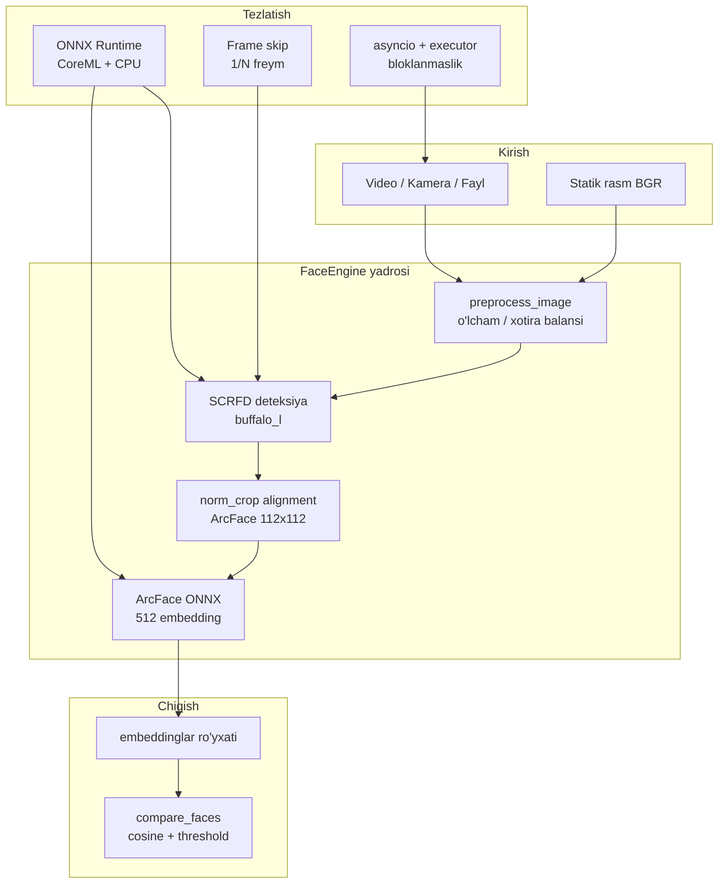

# Chaqimchi AI — Yuzni Tanish Yadrosi: Tizim Arxitekturasi

Bu hujjat **Face Recognition Core** modulining mantiqiy arxitekturasini o‘zbek tilida qisqa va aniq tasvirlaydi.

## 1. Maqsad va chegaralar

- **Maqsad**: real vaqtga yaqin video oqimida yuzni aniqlash, geometrik tekislash (alignment), 512 o‘lchamli embedding olish va ma’lum bazadagi vektorlar bilan kosinus o‘xshashligi bo‘yicha solishtirish.
- **Chegara**: bu modul faqat **kompyuter ko‘rishi yadrosi**; autentifikatsiya siyosati, foydalanuvchi interfeysi va server API alohida qatlamlarda bo‘lishi tavsiya etiladi.
- **Bu yerda yo‘q**: do‘kon analitikasi (odam deteksiyasi, sanoq, dwell, navbat) butunlay boshqa yo‘l — alohida jarayon, alohida model va o‘z inferens byudjeti bilan: [chaqimchi_ai/retail/README.md](../chaqimchi_ai/retail/README.md).

## 2. Yuqori darajadagi komponentlar

## 3. Ma’lumotlar oqimi (video)

1. **OpenCV** `VideoCapture` orqali freym olinadi (asinxron executor: asosiy event loop bloklanmaydi).
2. **Frame skipping**: har `N` freymdan bittasida inferens — CPU/GPU yukini pasaytiradi.
3. **Preprocess**: juda katta kadrlarni `max_side` bo‘yicha kichraytirish (aniqlik va tezlik muvozanati).
4. **Deteksiya**: InsightFace `buffalo_l` paketidagi **SCRFD** yuz qutisi va kalibr nuqtalar (`kps`) beradi.
5. **Alignment**: `insightface.utils.face_align.norm_crop` — ArcFace uchun standart **112×112** tekislangan kesma.
6. **Embedding**: tanish (recognition) ONNX sessiyasi `get_feat` orqali **512** vektor qaytaradi, keyin **L2 normalizatsiya** qilinadi (cosine uchun barqarorlik).
7. **Taqqoslash**: `compare_faces` — bitta manba vektorini ko‘p maqsad vektorlari bilan **kosinus o‘xshashligi** (normalizatsiya qilingan vektorlarda skalyar ko‘paytma) orqali solishtiradi.

## 4. Hisoblash infratuzilmasi (Apple Silicon)

- **onnxruntime-silicon**: Mac ARM uchun optimallashtirilgan ONNX Runtime build.
- **CoreMLExecutionProvider**: mavjud bo‘lsa, modellarning bir qismi yoki hammasi Apple tomonidan tezlashtirilishi mumkin (build va macOS versiyasiga bog‘liq).
- **CPUExecutionProvider**: har doim zaxira sifatida qo‘shiladi — barqaror ishlash uchun.

## 5. Kuzatuvchanlik (logging)

- Har bir inferens uchun **millisekund** da vaqt o‘lchovi.
- Deteksiya + tanish bo‘yicha alohida debug yozuvlari (kerak bo‘lsa `DEBUG` darajasi).

## 6. Kengaytirish nuqtalari (keyingi bosqichlar)

- **Embedding bazasi**: FAISS / Milvus / sqlite-vec bilan vektor indekslari.
- **Track ID**: yuzni kadrlar bo‘yicha izchil kuzatish (DeepSORT / BYTETrack va hokazo).
- **Xavfsizlik**: anti-spoofing, hayajon chegaralarini serverda qayta kalibrlash.

Bu hujjat loyiha rivojlanishi bilan yangilanishi kerak; API o‘zgarishlari `chaqimchi_ai/face_engine.py` dagi tip annotatsiyalar va docstringlar bilan sinxronlanadi.
