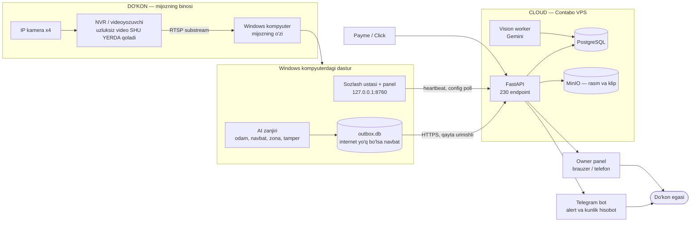
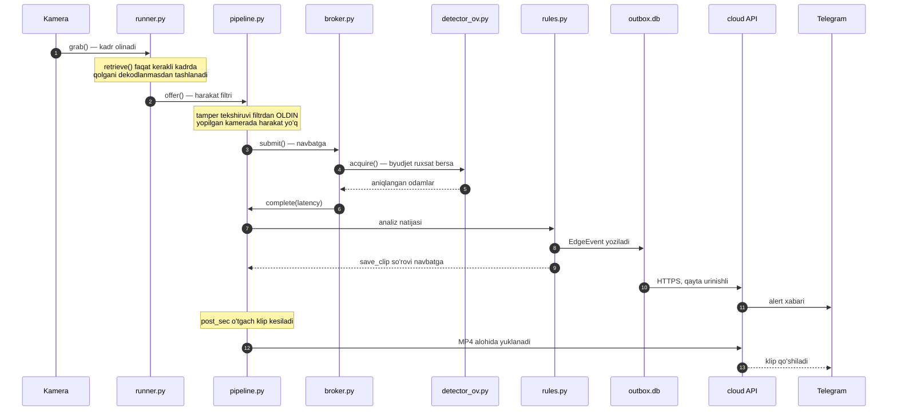
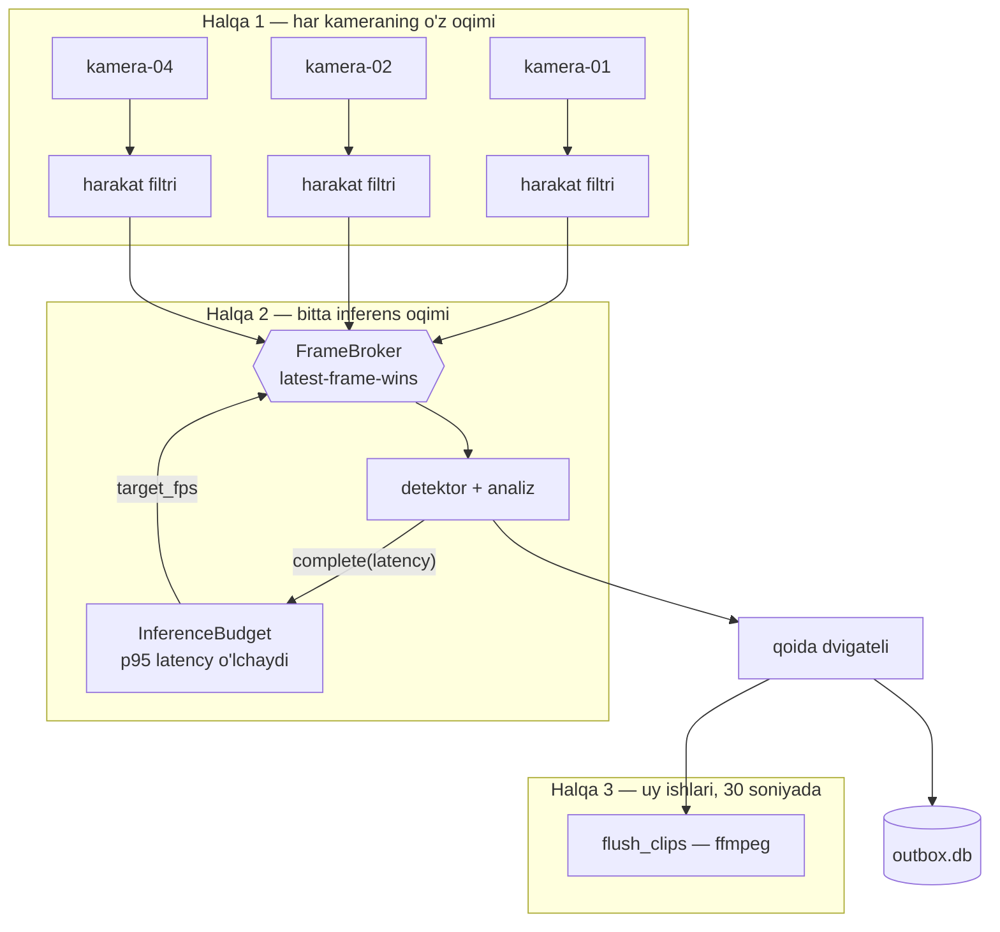
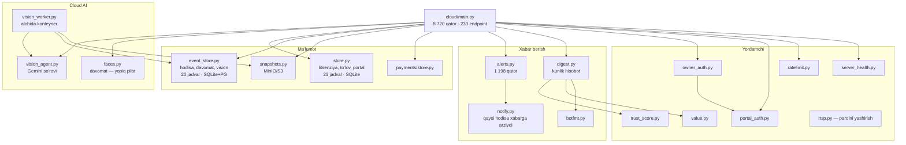
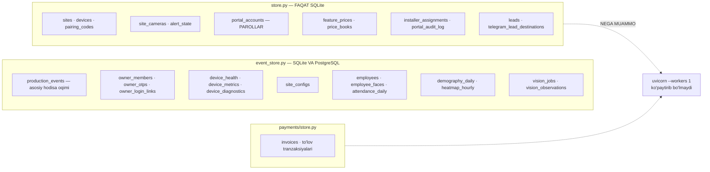
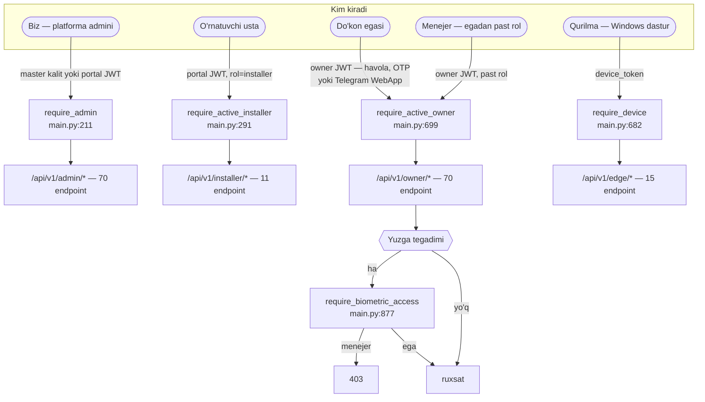
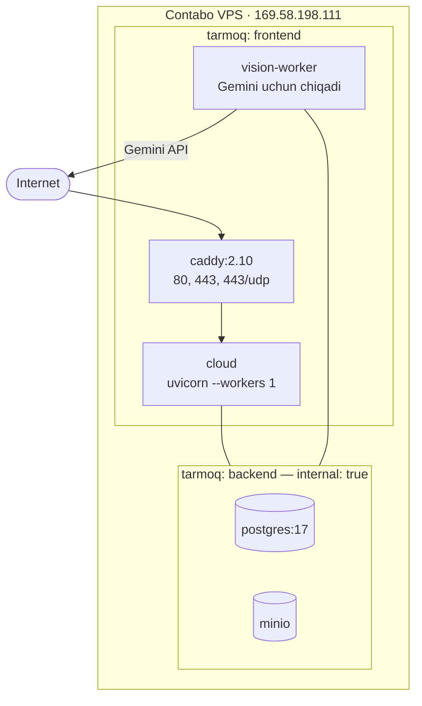
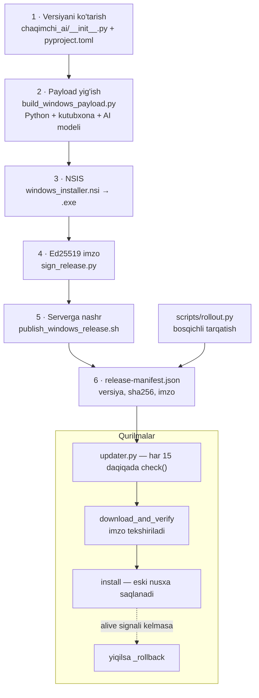
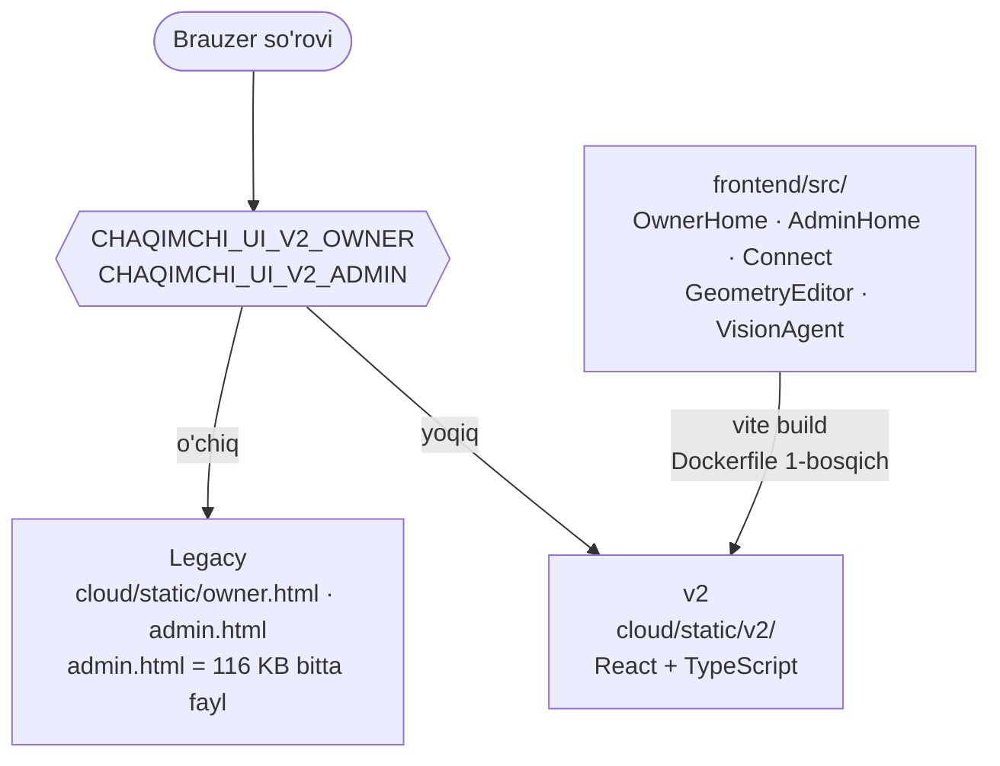

# Arxitektura xaritasi

> Maqsad: agent chizmaga qarab **to'g'ridan-to'g'ri kerakli faylni**
> topsin. Har chizmadan keyin "qaysi faylda" jadvali bor.
>
> Joriy holat va keyingi ish — [ISH_DAFTARI.md](ISH_DAFTARI.md).
> Mahsulot kontrakti — [DOKON_MVP.md](DOKON_MVP.md).

Hujjat ichida:

1. [Umumiy manzara](#1-umumiy-manzara)
2. [Hodisa yo'li — kadrdan Telegramgacha](#2-hodisa-yoli--kadrdan-telegramgacha)
3. [Edge ichki zanjiri](#3-edge-ichki-zanjiri)
4. [Cloud komponentlari](#4-cloud-komponentlari)
5. [Ikkita baza](#5-ikkita-baza)
6. [Rol va autentifikatsiya](#6-rol-va-autentifikatsiya)
7. [Deploy topologiyasi](#7-deploy-topologiyasi)
8. [Reliz va OTA yo'li](#8-reliz-va-ota-yoli)
9. [Panelning ikki avlodi](#9-panelning-ikki-avlodi)
10. [Kengayishga tayyorlik](#10-kengayishga-tayyorlik)

---

## 1. Umumiy manzara

Uch joy: **do'kon**, **cloud**, **mijozning telefoni**. Eng muhim
qoida — uzluksiz video do'konda qoladi, tarmoqdan faqat hodisa o'tadi.



**Nima tarmoqdan o'tmaydi:** uzluksiz video, RTSP parollari ochiq
holda (shifrlangan saqlanadi), xaridorning yuzi (umuman tanilmaydi).

| Qism | Fayl |
|---|---|
| Kamera chegarasi (4 ta) | `chaqimchi_ai/limits.py` |
| Sozlash ustasi va lokal panel | `chaqimchi_ai/local/app.py` |
| Cloudga ulanish (pairing) | `chaqimchi_ai/local/cloud_link.py` |
| AI zanjiri | `chaqimchi_ai/retail/` — [README](../chaqimchi_ai/retail/README.md) |
| Offline navbat | `chaqimchi_ai/outbox.py`, `chaqimchi_ai/cloud_sync.py` |
| Cloud API | `cloud/main.py` |
| Telegram | `cloud/alerts.py`, `cloud/notify.py`, `cloud/digest.py` |
| To'lov | `cloud/payments/` — `payme.py`, `click.py` |

---

## 2. Hodisa yo'li — kadrdan Telegramgacha

Eng ko'p savol tug'diradigan yo'l. Uchta narsa ataylab shunday:
**hodisa klipni kutmaydi**, **Telegramni cloud yuboradi**, va
**internet yo'q bo'lsa ham hodisa yo'qolmaydi**.



**Nega klip kechikadi:** hodisa 14:30:00 da bo'lsa klip
[14:29:50, 14:30:20] — oxirgi 20 soniya hali yozilmagan. Darhol kesilsa
aynan "keyin nima bo'ldi" yo'qoladi. Hodisaning o'zi kutmaydi.

**Nega Telegramni cloud yuboradi:** edge tomonda ikkinchi Telegram
mijozi bo'lsa mijoz bitta hodisa uchun ikkita xabar olardi.

| Qadam | Fayl |
|---|---|
| Kadr olish halqasi | `chaqimchi_ai/retail/runner.py` |
| Filtr, analiz, klip navbati | `chaqimchi_ai/retail/pipeline.py` |
| Navbat va byudjet | `chaqimchi_ai/retail/broker.py`, `budget.py` |
| Detektor | `chaqimchi_ai/retail/detector_ov.py` |
| Qoidalar | `chaqimchi_ai/retail/rules.py`, `config/rules.yaml` |
| Kamera buzilishi | `chaqimchi_ai/retail/tamper.py` |
| Navbat va uzatish | `chaqimchi_ai/outbox.py`, `chaqimchi_ai/cloud_sync.py` |
| Hodisa modeli | `chaqimchi_ai/event_models.py` |
| Cloud qabuli | `cloud/main.py` → `/api/v1/edge/events` |
| Alert tanlash va tormoz | `cloud/notify.py`, `cloud/alerts.py` |

---

## 3. Edge ichki zanjiri

8 kamera x 5 FPS = sekundiga 40 inferens; qurilma esa ~30 tasini
ulguradi. Yechim: **bitta umumiy byudjet**, kameralar raqobatlashadi.



**Uch tezlik, uch sabab:**

| Halqa | Tezlik | Nega ajratilgan |
|---|---|---|
| `offer()` | kameraning FPS'i | filtr arzon, bloklanmasin |
| `step()` | ~66 ms dan tez | byudjet token yo'qotmasin |
| `flush_clips()` | 30 soniyada | ffmpeg sekin, byudjetni yemasin |

**Uch qoida:** kredit (ulushga qarab), ochlik kafolati (`floor_fps` dan
sekin bo'lsa navbatni oladi), latest-frame-wins (har kameradan bitta
kadr kutadi).

**Kuzatiladigan ikki raqam:** `floor_violations` (qurilma yetishmayapti)
va `p95_latency_ms` (model sekinlashgan).

To'liq tafsilot — [chaqimchi_ai/retail/README.md](../chaqimchi_ai/retail/README.md).

| Qism | Fayl |
|---|---|
| Broker va byudjet | `chaqimchi_ai/retail/broker.py`, `budget.py` |
| Ring buffer (klip uchun) | `chaqimchi_ai/retail/ringbuffer.py` |
| Sanoq chiziqlari, zona | `chaqimchi_ai/retail/lines.py`, `chaqimchi_ai/scene_analytics.py` |
| Bosim signali | `chaqimchi_ai/retail/pressure.py` |
| Xizmat sifatida ishga tushirish | `chaqimchi_ai/retail/service.py` |
| Apparat imkoniyati | `chaqimchi_ai/local/hardware.py` |

---

## 4. Cloud komponentlari

`cloud/main.py` — **8 720 qator, 230 endpoint**. Bu markaz, va ayni
paytda eng katta to'siq (§10.1 ga qarang).



**`main.py` ichidagi fon vazifalari** (`lifespan`, `cloud/main.py:1492`):
kunlik digest, tozalash halqasi (`_maintenance_loop` — muddati o'tgan
hodisa va klip), demografiya rollup, lead xabarlari, va ixtiyoriy
in-app vision worker. Production'da vision worker **alohida
konteyner** (`CHAQIMCHI_VISION_WORKER_IN_APP=0`).

**Ishga tushishda production tekshiruvi** (`cloud/main.py:1495`
atrofida): `DATABASE_URL` PostgreSQL bo'lishi, S3, shifrlash kalitlari
va uchta JWT/admin kaliti kamida 32 belgi bo'lishi shart. Sinov
eshiklari (`CHAQIMCHI_OTP_TEST_CODE`, `CHAQIMCHI_OTP_BYPASS_IDS`)
production'da server **ataylab yonmaydi**.

| Vazifa | Fayl |
|---|---|
| Marshrutlar, fon vazifalari | `cloud/main.py` |
| Litsenziya/tarif mantiqi | `chaqimchi_ai/licensing/plans.py`, `enforce.py` |
| Ta'lim tarifi | `chaqimchi_ai/licensing/edu.py` |
| Server sog'ligi | `cloud/server_health.py` |
| Manzillar | `cloud/urls.py` |

---

## 5. Ikkita baza

Bu chizma **muammoni** ko'rsatadi: bir xil serverda ikki xil baza
yondashuvi yashaydi.



**Nega shunday bo'lgan:** `event_store.py` hodisa hajmi tufayli
PostgreSQL'ga ko'chirilgan (`self.postgres` + `_q()` naqshi,
`cloud/event_store.py:95`), `store.py` esa qolib ketgan. Natijada
**to'lov va parol ma'lumotlari production'da ham SQLite'da** (audit
YUQORI-10) va cloud bitta worker'da qotib turibdi.

**Migratsiya:** `store.py:1268 _migrate()` — qo'lda `ALTER TABLE`,
`try/except` bilan. Versiya raqami yo'q, ya'ni qaysi qadam bajarilgani
kodni o'qimasdan bilinmaydi.

| Nima | Qayerda |
|---|---|
| SQLite/PG almashtirish naqshi | `cloud/event_store.py:95` va `:121` |
| Qo'lda migratsiya | `cloud/store.py:1268` |
| Media (rasm, klip) | `cloud/snapshots.py` → MinIO |
| Kamera parollari | shifrlangan — `CHAQIMCHI_CAMERA_SECRET_KEY` |

---

## 6. Rol va autentifikatsiya

To'rt xil kirish, to'rt xil kalit. Aralashtirish — eng qimmat xato.



**Uchta alohida sir** — aralashtirilmasin:
`CHAQIMCHI_OWNER_JWT_SECRET`, `CHAQIMCHI_PORTAL_JWT_SECRET`,
`CHAQIMCHI_CLOUD_ADMIN_KEY`. Umumiy `CHAQIMCHI_JWT_SECRET` qo'yilsa
owner va portal ajratilishi **bekor bo'ladi** — serverda u yo'q va
shunday qolsin (audit O'RTA-7).

**Egaga kirish yo'li:** admin paneldagi "Kirish havolasi" tugmasi yoki
Telegram bot `/start` beradigan `?key=<token>`. Eski `?tg=` va
`CHAQIMCHI_OTP_BYPASS_IDS` olib tashlangan.

| Qism | Fayl |
|---|---|
| Owner token | `cloud/owner_auth.py` |
| Portal token (admin/usta) | `cloud/portal_auth.py` |
| JWT yadrosi | `chaqimchi_ai/jwt_auth.py` |
| Davomat darvozasi | `cloud/main.py:834` `_attendance_enabled()` |
| Testlar | `tests/test_portal_auth.py`, `tests/test_cloud_faces.py` |

---

## 7. Deploy topologiyasi



**Uchta tuzoq** — har biri jonli saytda kuyib bo'lingan:

1. **`443:443/udp` qatori shart.** Bo'lmasa Caddy `alt-svc: h3` deb
   e'lon qilaveradi, brauzer QUIC'ga urinadi, paket yetmaydi va TCP'ga
   qaytadi — har ulanishda bekorga kutish.
2. **`vision-worker` `frontend` tarmog'ida ham bo'lishi shart.**
   `backend` `internal: true` — faqat unda qolsa gateway bo'lmaydi va
   har Gemini chaqiruvi tarmoq xatosi bilan yiqiladi.
3. **`./releases:/app/releases:ro` bind mount qolsin.**
   `.dockerignore` da `releases/` bor va shunday qolishi kerak; qator
   olib tashlansa bir buyruqli o'rnatish umuman ishlamaydi.

**Konteyner qattiqlashtirilgan:** `read_only: true`, `cap_drop: ALL`,
`no-new-privileges`, `pids_limit`, `USER 10001`.

**Deploy git bilan EMAS** — `rsync`. Buyruq va `--exclude` ro'yxati:
[DEPLOY_TARIFLAR.md](DEPLOY_TARIFLAR.md) §3, zaxira va tekshiruv:
[PRODUCTION_RUNBOOK.md](PRODUCTION_RUNBOOK.md).

| Fayl | Vazifa |
|---|---|
| `docker-compose.chaqimchi.yml` | jonli compose |
| `Dockerfile.cloud` | uch bosqichli: React → pip → runtime |
| `deploy/Caddyfile.chaqimchi` | subdomenlar |
| `scripts/deploy_cloud.sh` | zaxira + deploy |
| `scripts/backup_production.sh` | kunlik zaxira |
| `scripts/production_preflight.py` | deploydan oldingi tekshiruv |

---

## 8. Reliz va OTA yo'li



**Bosqichli tarqatish:** avval o'z qurilmamiz avtomatik oladi, mijozlar
`hold` da turadi, 24 soatdan keyin ochiladi
([RELIZ_VA_OTA.md](RELIZ_VA_OTA.md)).

**Nega `.exe` git'da yo'q:** ~70 MB, repo tarixini qaytarib bo'lmas
darajada shishirardi. `.gitignore` da `releases/*.exe`. Fayl GitHub
Releases'da yoki serverdagi `releases/` da turadi.

**Ikki nom, ikki ma'no:** `Chaqimchi_AI_Setup.exe` — build artefakti,
ichki hujjatlarda **to'g'ri**. `publish_windows_release.sh` uni nashrda
`Chaqimchi_AI_Setup-<versiya>.exe` deb qayta nomlaydi.

| Qism | Fayl |
|---|---|
| Payload | `scripts/build_windows_payload.py` |
| O'rnatuvchi | `scripts/windows_installer.nsi` |
| Imzo | `scripts/sign_release.py`, `generate_update_key.py` |
| Nashr | `scripts/publish_windows_release.sh` |
| Qurilma tomoni | `chaqimchi_ai/local/updater.py`, `chaqimchi_ai/signed_update.py` |
| Bosqichli tarqatish | `scripts/rollout.py` |
| CI | `.github/workflows/windows-installer.yml` |
| Kontrakt testi | `tests/test_sotqin_release_contract.py` |

---

## 9. Panelning ikki avlodi

Hozir **ikkalasi ham repoda** va env bilan almashtiriladi.



**Legacy `admin.html` da yangi sahifa qo'shsangiz:** `NAV[].deps ⊆
LOADERS ⊆ S` zanjiri buzilmasin. Moliya paneli aynan shundan
ochilmagan edi — `S` da kalit yo'q edi, `need()` esa faqat `=== null`
ni yuklaydi, ya'ni so'rov umuman yuborilmasdi. Struktura testi bor.

**`make test` TS typecheck'ni ham yuritadi** — v2 buzilgan holda
"test o'tdi" degan yolg'on ishonch bo'lmasin.

Yoqish/qaytarish tartibi: [PRODUCTION_RUNBOOK.md](PRODUCTION_RUNBOOK.md) §5.

| Qism | Fayl |
|---|---|
| Legacy panel | `cloud/static/admin.html`, `owner.html`, `panel.css` |
| v2 manba | `frontend/src/` |
| v2 qurilishi | `frontend/vite.config.ts` → `cloud/static/v2` |
| Ommaviy sayt | `cloud/static/site.html`, `edu.html`, `oferta.html` |
| Sayt va'dalari qulfi | `tests/test_static_pages.py` |

---

## 10. Kengayishga tayyorlik

Loyiha katta kompaniya darajasiga tayyorlanmoqda. Quyidagi yettita band
— hozirgi tuzilmaning **haqiqiy chegaralari**. Har biri: nima, nega
to'siq, qanday hal qilinadi, qachon kerak.

| # | Ish | Qachon kerak |
|---|---|---|
| 1 | `cloud/main.py` ni bo'lish | **HOZIR** — rivojlanishni sekinlashtiryapti |
| 2 | `store.py` ni PostgreSQL'ga | mijoz 50 dan oshganda yoki to'lov auditidan oldin |
| 3 | Migratsiya versiyasi | **HOZIR** — 1 va 2 dan oldin qilinsa xavfsizroq |
| 4 | Rate limit va sessiya umumiy xotiraga | ikkinchi server qo'shilganda |
| 5 | 96 ta env'ni bitta `Settings` obyektiga | 1 bilan birga qilinsa arzon |
| 6 | Kuzatuvchanlik — strukturali log | mijoz 20 dan oshganda |
| 7 | Panel bitta avlodga kelsin | v2 to'liq tayyor bo'lgach |

### 10.1 · `cloud/main.py` ni bo'lish

**Hozir:** 8 720 qator, 230 endpoint, ~60 Pydantic modeli, fon
vazifalari va statik sahifalar — hammasi bitta faylda.

**Nega to'siq:** ikki agent bir paytda ishlay olmaydi (konflikt
kafolatlangan); faylni to'liq o'qish kontekst oynasining katta qismini
yeydi; bitta xato butun API'ni yiqitadi.

**Maqsad tuzilma:**

```
cloud/api/
  __init__.py     — router'larni yig'adi
  deps.py         — require_* va get_* (main.py:144-291, 682-877)
  schemas.py      — ~60 Pydantic modeli (main.py:297-682)
  admin.py        — ~70 endpoint
  owner.py        — ~70 endpoint
  edge.py         — ~15 endpoint
  installer.py    — ~11 endpoint
  public.py       — ~10 endpoint
  sotqin.py       — ~9 endpoint
  auth.py         — ~4 endpoint
  payments.py     — ~3 endpoint  (+ /invoices, /pay)
  pages.py        — statik sahifalar va SEO
cloud/main.py     — faqat app, lifespan, fon vazifalari, router ulash
```

**DIQQAT — eng muhim tafsilot:** marshrutlar faylda **aralash yotibdi**.
`admin`, `owner`, `edge` va `sotqin` guruhlari qator bo'yicha ~48 marta
almashadi (masalan `edge` 4800, 5165, 5196, 5241, 5384... qatorlarda).
Ya'ni **qator oralig'i bo'yicha ko'chirib bo'lmaydi** — har dekorator
alohida ko'chiriladi.

**Tartib** (har qadamdan keyin `make test`):

1. Avval `deps.py` va `schemas.py` — qolgan hamma narsa shularga tayanadi.
2. Keyin eng kichik guruhlar: `auth`, `payments`, `sotqin`, `installer`.
3. Keyin `edge` va `public`.
4. Oxirida eng kattalari: `owner`, `admin`.
5. `pages.py` — statik sahifalar, eng oxirida.

**Qulflash:** ko'chirishdan **oldin** marshrut ro'yxatini yozib oling va
test qiling — usul, yo'l va `include_in_schema` o'zgarmasin:

```python
def test_route_list_unchanged():
    got = sorted((r.path, tuple(sorted(r.methods))) for r in app.routes if hasattr(r, "methods"))
    assert got == EXPECTED   # ko'chirishdan oldin yozib olingan ro'yxat
```

Bu testsiz bo'lishni **boshlamang**: bitta unutilgan dekorator jimgina
404 beradi va mijoz panelida ko'rinadi.

### 10.2 · `store.py` ni PostgreSQL'ga

**Hozir:** 23 jadval, 3 376 qator, faqat SQLite. Ichida litsenziya,
tarif, narx kitobi, portal parollari va audit jurnali.

**Nega to'siq:** `Dockerfile.cloud` da `--workers 1` aynan shu sabab —
SQLite bir faylga ko'p jarayondan yozishga yaramaydi. Ya'ni cloud
**gorizontal kengaya olmaydi** va bitta CPU yadrosi bilan cheklangan.
Zaxira ham ikki xil: PostgreSQL dump va SQLite fayl nusxasi.

**Qanday:** g'ildirak qaytadan ixtiro qilinmaydi — `event_store.py`
dagi naqsh allaqachon ishlaydi va sinovdan o'tgan:

```python
self.postgres = self.database_url.startswith(("postgres://", "postgresql://"))
def _q(self, query): return query.replace("?", "%s") if self.postgres else query
```

Tartib: (a) `store.py` ga shu ikki narsani qo'shish, (b) `CREATE TABLE`
larni ikkala dialektga moslash, (c) mavjud SQLite ma'lumotini
ko'chiruvchi bir martalik skript, (d) **zaxira va restore mashqi**
([PRODUCTION_RUNBOOK.md](PRODUCTION_RUNBOOK.md) §2.2), (e) shundan
keyingina `--workers` ni ko'tarish.

**Diqqat:** `payments/store.py` ham xuddi shunday — u pul bilan
ishlaydi, ya'ni ko'chirishda eng ehtiyot bo'linadigan qism.

### 10.3 · Migratsiya versiyasi

**Hozir:** `cloud/store.py:1268 _migrate()` — qo'lda `ALTER TABLE`
lar, `try/except` bilan o'ralgan, ikki joyda jadval qayta
yaratilgan (`lead_notification_deliveries`, `alert_state`).

**Nega to'siq:** qaysi qadam bajarilgani kodni o'qimasdan bilinmaydi;
orqaga qaytarish yo'q; PostgreSQL'ga ko'chishda (§10.2) bu chalkashlik
ikki barobar og'irlashadi.

**Qanday:** `schema_version` jadvali + raqamlangan qadamlar ro'yxati.
Har qadam bir marta bajariladi va yozib qo'yiladi. Katta kutubxona
(Alembic) shart emas — 50 qatorlik o'z yechimi yetadi va bog'liqlik
qo'shmaydi.

### 10.4 · Rate limit va sessiya

**Hozir:** `cloud/ratelimit.py` — xotirada, fixed window, restartda
nolga tushadi. Bu **ataylab** shunday: Redis'siz ishlaydigan eng sodda
himoya, bitta VPS uchun yetadi (fayl o'zi shuni yozgan).

**Qachon yaramaydi:** ikkinchi cloud instansiyasi paydo bo'lganda —
har biri o'z hisobini yuritadi va chegara ikki barobarga chiqadi.
Owner sessiyalari ham shunday.

**Qanday:** umumiy hisoblagich (Redis yoki PostgreSQL jadvali).
§10.2 dan keyin qilinadi, undan oldin emas.

### 10.5 · Env tartibga solish

**Hozir:** 96 ta `CHAQIMCHI_*` o'zgaruvchisi, kod bo'ylab
`os.environ.get(...)` bilan tarqoq. Standart qiymatlar chaqiruv
joyida yozilgan.

**Nega to'siq:** yangi odam qaysi o'zgaruvchi majburiyligini bilmaydi;
nomi xato yozilgan o'zgaruvchi **jimgina** standart qiymatga tushadi.
Aynan shu tuzoq 0.6.13 muammosini keltirib chiqargan
([ISH_DAFTARI.md](ISH_DAFTARI.md) "Tuzoqlar").

**Qanday:** bitta Pydantic `Settings` obyekti. Yaxshi tomoni — namuna
allaqachon bor: `cloud/main.py:1492` dagi production tekshiruvi
majburiy o'zgaruvchilarni sanaydi va topilmasa **ataylab yonadi**. Shu
mantiq bitta joyga yig'iladi. §10.1 bilan birga qilinsa arzon.

### 10.6 · Kuzatuvchanlik

**Hozir:** `/health`, `/health/deep` (rolga qarab qisqaradi) va
`json-file` log drayveri (10 MB x 5). Tashqaridan UptimeRobot qaraydi.

**Nega yetmaydi:** mijoz "kecha soat 3 da xabar kelmadi" desa, log
ichidan o'sha so'rovni topishning yo'li yo'q — so'rov ID yo'q,
loglar strukturali emas.

**Qanday:** (a) har so'rovga ID va uni javob sarlavhasida qaytarish,
(b) strukturali (JSON) log, (c) hodisa oqimining asosiy raqamlarini
`/metrics` ga chiqarish. Uchinchisi mijoz 20 dan oshganda kerak
bo'ladi.

### 10.7 · Panel bitta avlodga kelsin

**Hozir:** `admin.html` (116 KB, bitta fayl) va React `v2` yonma-yon.
Har o'zgarish **ikki joyda** qilinishi kerak yoki ikkisi ajralib
ketadi.

**Qanday:** v2 to'liq tenglashgach `CHAQIMCHI_UI_V2_*` doimiy yoqiladi,
bir reliz kutiladi, keyin legacy fayllar o'chiriladi. Qaytarish yo'li
[PRODUCTION_RUNBOOK.md](PRODUCTION_RUNBOOK.md) §5 da.

---

## Nima o'zgarganda bu hujjat yangilanadi

- Yangi xizmat yoki konteyner qo'shilsa → §1, §7
- Marshrut guruhi o'zgarsa yoki `main.py` bo'linsa → §4, §6, §10.1
- Jadval qo'shilsa → §5
- Reliz tartibi o'zgarsa → §8
- §10 dagi band bajarilsa → o'sha bandni "bajarildi" deb belgilang va
  [ISH_DAFTARI.md](ISH_DAFTARI.md) tarixiga yozing.
